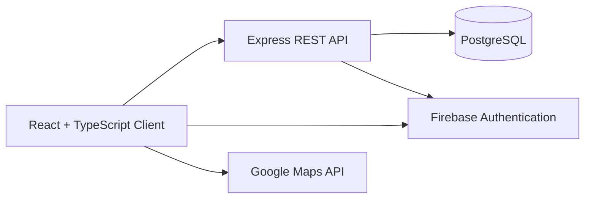

# PinPro

### A full-stack virtual golf caddy for smarter club selection and better round tracking.

[](https://pin-pro.vercel.app)


## Overview

PinPro turns a golfer's own club distances and round history into practical on-course guidance. Players can build a personalized golf bag, record rounds, receive club suggestions for a target distance, and review performance trends from one application.

I built PinPro as an end-to-end product to explore how a real sports workflow can be translated into a useful full-stack experience—from authentication and relational data modelling to recommendation logic and performance visualization.

## Core Features

- **Personalized golf bag:** Save a custom yardage for each club so recommendations reflect the player's actual game.
- **Smart club suggestions:** Match a target distance with the most appropriate club from the player's saved data.
- **Round tracking:** Record course details, holes, shots, distances, scores, and recommended clubs throughout a round.
- **Performance dashboard:** Review previous rounds, average and best scores, handicap information, and score trends.
- **Secure accounts:** Register with email and password or sign in with Google through Firebase Authentication.
- **Persistent player data:** Store profiles, clubs, and round history in PostgreSQL through a dedicated REST API.

## Architecture



The frontend handles the player experience, protected navigation, round entry, and Chart.js visualizations. The Express backend owns account synchronization, club persistence, round history, and handicap updates. PostgreSQL stores the relational player data, while Firebase provides email/password and Google identity flows.

## Technical Decisions

- Used **TypeScript across the frontend and backend** to keep data contracts explicit and reduce runtime errors.
- Separated the **React client, REST API, and PostgreSQL data layer** so each part of the system can evolve independently.
- Built club recommendations from **player-specific yardage data** instead of relying on generic distance assumptions.
- Protected application routes and synchronized Firebase identities with the backend user model.
- Calculated updated handicap information from recent round performance and surfaced trends with Chart.js.
- Designed responsive flows for club setup, active round tracking, round summaries, and player history.

## Tech Stack

| Layer | Technologies |
| --- | --- |
| Frontend | React 19, TypeScript, Tailwind CSS, React Router, Chart.js, Vite |
| Backend | Node.js, Express, TypeScript, REST APIs |
| Data | PostgreSQL, node-postgres |
| Authentication | Firebase Authentication, Firebase Admin, JWT |
| Integrations | Google Maps API |
| Deployment | Vercel frontend, Render backend |

## Running Locally

### Prerequisites

- Node.js 18+
- npm
- PostgreSQL database
- Firebase project
- Google Maps API key

### Frontend

```bash
cd pinpro/frontend
npm install
npm run dev
```

The frontend expects the following environment variables:

```env
VITE_FIREBASE_API_KEY=
VITE_FIREBASE_AUTH_DOMAIN=
VITE_FIREBASE_PROJECT_ID=
VITE_FIREBASE_STORAGE_BUCKET=
VITE_FIREBASE_MESSAGING_SENDER_ID=
VITE_FIREBASE_APP_ID=
VITE_GOOGLE_MAPS_API_KEY=
```

### Backend

```bash
cd pinpro/backend
npm install
npm run dev
```

The backend expects:

```env
DATABASE_URL=
JWT_SECRET=
FIREBASE_PROJECT_ID=
FIREBASE_PRIVATE_KEY=
FIREBASE_CLIENT_EMAIL=
```

## What I Learned

PinPro strengthened my ability to design and deliver a complete product across the frontend, API, authentication, and database layers. It also reinforced the importance of modelling real user behaviour first: the most useful recommendation is not based on an average golfer, but on the clubs and distances belonging to the player using the product.

## Author

Built by [Siddh Patel](https://github.com/LimitlessSiddh).
